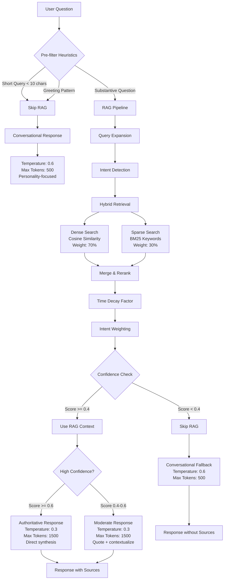

# LLM RAG System Flow Diagram

## Flow Explanation

### Pre-filtering Stage

- **Short queries** and **greetings** bypass RAG entirely for immediate personality
- **Substantive questions** enter the full RAG pipeline

### RAG Pipeline

1. **Query Expansion**: Add synonyms and related terms
2. **Intent Detection**: Identify question type (resume, blog, project, essay)
3. **Hybrid Retrieval**: Combine dense embeddings (70%) with sparse BM25 (30%)
4. **Merge & Rerank**: Combine results with time decay and intent weighting
5. **Confidence Check**: Determine if retrieved context is sufficient

### Response Generation

- **High confidence (≥0.6)**: Authoritative synthesis with citations
- **Medium confidence (0.4-0.6)**: Quote relevant passages with context
- **Low confidence (<0.4)**: Conversational fallback without sources

### Key Features

- **Never hallucinates**: Only uses retrieved context or acknowledges limitations
- **Maintains personality**: Higher temperature for conversational responses
- **Ensures accuracy**: Lower temperature when using retrieved context
- **Progressive disclosure**: More detail as confidence increases
